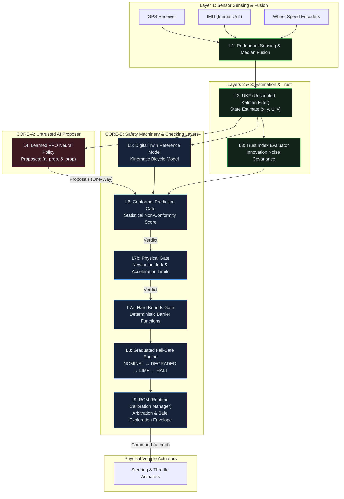

# ASTRA Architectural Graphical Model

## Overview
ASTRA (**Autonomous Safety, Trust, and Runtime Architecture**) enforces structural separation between an untrusted AI Proposer (**Core-A**) and physical vehicle actuators through a mechanically isolated 9-layer safety governance pipeline (**Core-B**).

---

## 9-Layer Architectural Diagram

---

## Key Separation Invariants

1. **One-Way Boundary (Core-A → Core-B):** The AI policy ($L4$) can only issue *proposals*. It has no direct access to actuators.
2. **Deterministic Override:** If any Core-B gate ($L6, L7b, L7a$) issues a `VETO`, $L8$ escalates protection and $L9$ overrides the command to a safe physical baseline.
3. **Uncertified Context Resilience (Tunnel Scenario):** When entering an uncertified domain, $L9$ RCM engages **Bounded Safe Exploration** (restricting speed and steering envelope) rather than halting the vehicle.
